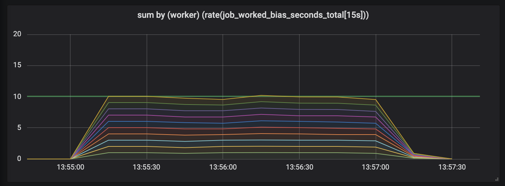
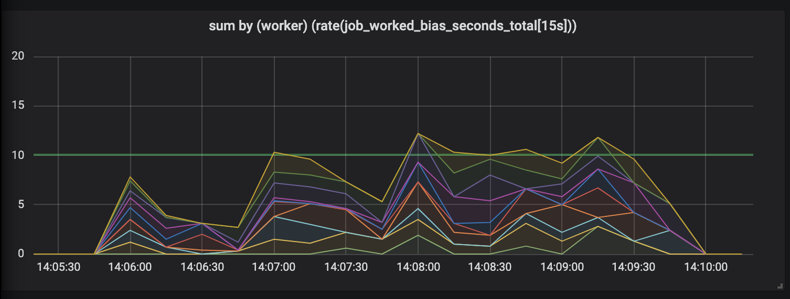

# prometheus-client-tracer-ruby [](https://circleci.com/gh/lawrencejones/prometheus-client-tracer-ruby)

https://blog.lawrencejones.dev/incremental-measurement/

This gem provides an interface for tracing long-running duration measurements
using the Prometheus client. By updating the associated metric as part of the
Prometheus /metrics endpoint, the increment is spread evenly over the scrapes
that occur while the operation is in process, instead of applying one large
increment at the end.

If you find this useful and would prefer it to live within the official
Prometheus Ruby client, please drop your feedback as a comment here:
https://github.com/prometheus/client_ruby/pull/135

## Why?

One of the most common observability requirements is to trace the amount of time
spent running a job or task. This information is useful in the context of when
this time was spent. The typical implementation of such a measurement might be:

```ruby
def run
  start = Time.now
  long_running_task
  metric.increment(by: start - Time.now)
end
```

The metric tracking duration is incremented only once the task has finished. If
the task took > Prometheus scrape interval, perhaps by a significant factor (say
1hr vs the normal 15s scrape interval), then the metric is incremented by a huge
value only after the task has finished.  Graphs visualising how time is spent
will show no activity while the task was running and then an impossible burst
just as things finish.

When jobs run quickly, your graphs will look reasonable. An example with ten
workers constantly working small jobs, each worker reports one second of work
per second, as the world should be.



As soon as job duration increases, the bias becomes significant, and the graph
starts departing from reality:



## How?

To avoid this time of measurement bias, this gem provides a metric tracer
that manages updating metrics associated with long-running tasks. Users will
begin a trace, do work, and while the work is on-going any calls to the tracer
collect method will incrementally update the associated metric with elapsed
time.

This is a game-changer in terms of making metrics usable, removing a huge source
of uncertainty when interpreting metric measurements. The implementation of the
tracer is thread safe and designed to be as lightweight as possible- it should
hopefully provide no performance hit and be preferable for tracing durations of
most lengths, provided you don't exceed hundreds of on-going traces.

For easy use, we patch the Prometheus client with a global tracer, following the
example of the global registry. Most users will want to use tracers without
initialising one in their own code, and can do so like this:

```ruby
def run
  Prometheus::Client.trace(metric, { worker: 1 }) do
    long_running_task
  end
end
```

Without any additional configuration, users who do this will see their metrics
update just as frequently as the naive implementation. For the incremental
measurement to work, they must use a `TraceCollector` to trigger a collection
just prior to serving metrics:

```ruby
# By default, collect the global tracer
use Prometheus::Middleware::TraceCollector
```
